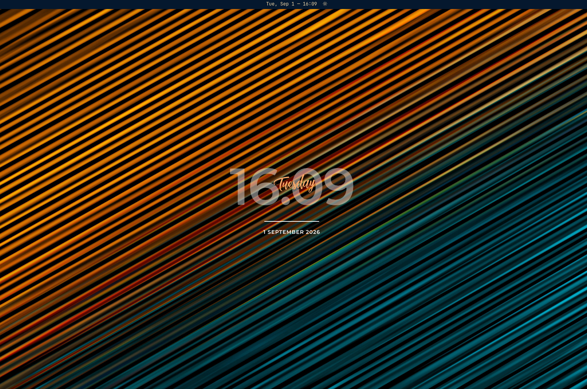

# Omark Meter

Robik-inspired Rainmeter clock for Omarchy (Hyprland + Quickshell) — renders on the desktop **Background** layer as a `PanelWindow` per monitor.



## Features (MVP)

*   Huge translucent time `hh:mm` (colon separator, 24h) — **Montserrat SemiBold 600** (middleground between Thin/ExtraBold)
*   Script weekday overlay — **MovingSkate** (brush, `Typhoon Type`)
*   Divider + `D MMMM YYYY` date
*   Theme-following accent (`Color.accent`)
*   Double-click desktop: left → `omarchy-theme-bg-switcher`, right → `omarchy-theme-switcher`
*   Modular `Loader` stubs for Phase 2 visualizer/metrics

## Install

```bash
# manual
mkdir -p ~/.config/omarchy/plugins/george.omarkmeter
cp -r assets Clock.qml RobikClock.qml manifest.json ~/.config/omarchy/plugins/george.omarkmeter/
quickshell ipc -p /usr/share/omarchy/shell call shell rescanPlugins
# or via helper
omarchy plugin add https://github.com/Compourri/omarkmeter.git --enable --yes
```

Add to `~/.config/omarchy/shell.json` `plugins: [{id:"george.omarkmeter"}]` is handled by the helper.

## Layout knobs

`RobikClock.qml`: `heroSize`, `scriptSize`, `heroOpacity`, `heroColor`, `dividerWidth` — `Clock.qml`: `offsetX/Y` to shift off center.

## Plugin

*   `id: george.omarkmeter` — `name: Omark Meter` — `kinds: [service]` — `entryPoints.service: Clock.qml`
*   Fonts: `assets/MovingSkate.ttf` (personal-use, Typhoon Type), `assets/Montserrat-*.otf` (OFL)

## License

MIT — see `LICENSE` (fonts have their own licenses).

